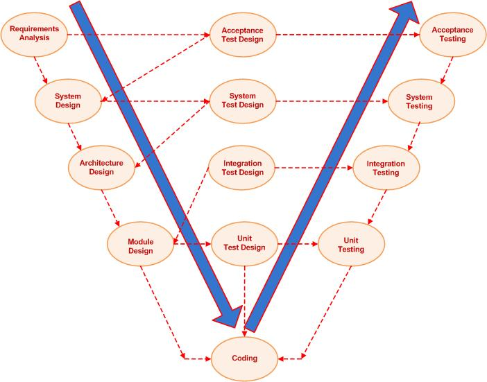

# V-Model
소프트웨어 개발 프로세스로 워터폴 모델의 확장된 형태

그림과 같이 코딩단계에서 위쪽으로 꺾여서 V자 모양으로 진행된다. V모델은 개발 생명주기의 각 단계와 그에 상응하는 소프트웨어 시험 각 단계의 관계를 보여준다.

## 검증 단계들
### 요구사항 분석

### 시스템 설계

### 아키텍처 설계

### 모듈 설계

## 유효화 단계들
### 단위 테스트

### 통합테스트

### 시스템테스트

### 인수테스트

출처
=============
* https://ko.wikipedia.org/wiki/V_%EB%AA%A8%EB%8D%B8
