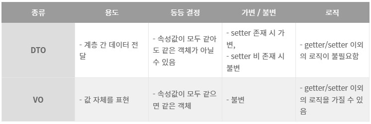

# DTO(Data Transfer Object)

## DTO(Data Transfer Object)
메서드 수를 줄이기 위한 `프로세스 간`에 데이터를 전달하는 역할을 수행, 로직을 가지지 않는 순수한 데이터 객체

### VO
직장에서 내가 주요로 사용한 VO는 DTO와 달리 Read-Only속성을 지닌 값 오브젝트이다. VO는 getter만 가지고 있어 수정이 불가능 하다.

출처 - (https://dkswnkk.tistory.com/500)

### 프로세스 간 통신(IPC, Inter-Process Communication)
서로 다른 프로세스간의 통신,백엔드와 프론트엔드로 티어를 나눈다면 IPC가 필수적이다 
* 공유 메모리 기법 
  다중 프로세스들이 가상 메모리를 공유, 협력 프로세스간에 공유되는 메모리 영역이 운영체제에 의해 구축 제공됨
* 메세지 전달 기법 
  협력 프로세스간의 메세지 교환
  + File -> 가장 기본적인 접근
  + Socket -> 파일과 유사하게 사용 가능
* RPC(Remote Procedure Call) 
 별도의 원격 제어 코딩 없이 `다른 주소 공간에서 함수나 프로시저를 실행`할 수 있게 하는 프로세스 간 통신 기술
* RMI(Remote Method Invocation)
  직렬화 된 JAVA 클래스의 전송, RPC를 자바에서 사용하는 것

## “무기력한 도메인 모델” 이란 그리고 안티 패턴인 이유
## 자바빈즈(JavaBeans)
자바로 작성된 소프트웨어 컴포넌트
* 직렬화 되어야 한다.
* 기본 생성자를 가지고 있어야 한다.
* 클래스 내의 속성들은 메서드들을 통해 접근 할 수 있어야 한다.
* 필요한 이벤트 처리 메서드들을 포함하고 있어야 한다.

## EJB(Enterprise JavaBeans)
서버측 컴포넌트 모델  
이 거 때문에 SPRING이 나오게 됐다고 알고 있다.
객체지향적이지 못하고, 너무 복잡하고 종속적이라는 단점이 있다.

## Java의 record
## DAO(Data Access Object)
데이터베이스에 접근하여 CRUD처리를 담당하는 객체, 현재 SI에서는 사용되고 있으며 Mapper class라고도 명명하면서 사용.. 너무 짬뽕
## ORM(Object Relational Mapping)
* 객체와 관계형 데이터베이스의 데이터를 자동으로 매핑해주는 것을 말한다. 
* DB (테이블) <----> 객체지향 프로그래밍(객체클래스)

출처 - (https://gmlwjd9405.github.io/2019/02/01/orm.html)

