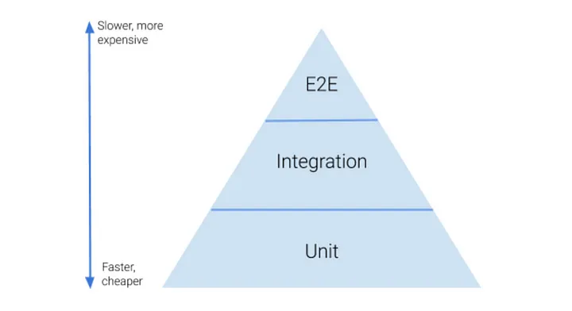

# Unit Test

## V-Model
워터폴 개발모델에서 확장된 형태, V모델은 개발 생명주기의 각 단계와 그에 상응하는 소프트웨어 시험 각 단계의 관계를 보여준다.
## Test Matrix

## 내적 품질을 높이면 좋은 이유
장기적인 생산성을 높일 수 있다.
## JUnit
자바를 위한 개발자 친화 테스팅 프레임워크, 이름에 Unit이 들어가지만 단위테스트만 지원하는 것은 아니다. 통합테스트,E2E테스트를 작성하는데도 사용
## 단위테스트

##  E2E테스트
End to End의 약자로 애플리케이션의 흐름을 처음부터 끝까지 테스트하는 것을 의미, 유닛테스트나 통합테스트가 모듈의 무결성을 증명할 수 있는 강력한 테스트 이지만 모듈의 무결성이 애플리케이션 동작의 무결성까지는 증명해 줄 수 없다.  
해서 실제 사용자의 시나리오로 테스트해서 **애플리케이션의 무결성**을 증명할 수 있게 된다.

 실제 사용자의 시나리오대로 테스트를 한다는 것은 많은 비용이 발생한다는 뜻이다. 위의 그림은 테스트의 비중과 비용에 대해 나타내는 테스트 피라미드 그림이다. 물론 이는 테스트를 관리하는 데 사용되는 수많은 이론 중 하나일 뿐이지만 비용이 많이 드는 만큼 꼭 필요한 테스트만 수행해야 한다는 의견이 주다.
### 출처
* https://fe-developers.kakaoent.com/2023/230209-e2e/